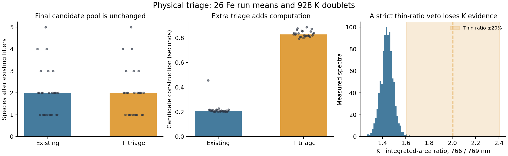

# Physical LIBS triage and early Ar/O detection

Date: 2026-09-22. No provider switch, deployment, or hardware action occurred.

## Outcome

Added database-grounded physical priors, dedicated early Ar I/O I diagnostics,
reproducible real-data benchmarks, and optional pass-1 candidate triage. Gas
diagnostics run by default before the first composition fit. General triage
remains **off by default**: it did not reduce the final candidate pool and made
candidate construction approximately four times slower on the measured data.
This work does not establish an acceleration or improved composition accuracy.

The new triage retains the nominal Fe positive in all 26 measured run means.
Existing downstream filters then remove Fe in all 26, with or without the new
triage. This separate correctness problem was diagnosed but not changed here.
The real spectra do not independently establish Ar/O detection sensitivity.

## Priors and implementation

The [physical-prior reference](../docs/physical_triage_priors.md) derives the
relationships and links primary sources. Citations are pinned in
[physical-triage-sources-20260922.json](../provenance/physical-triage-sources-20260922.json).

| Prior | Treatment |
|---|---|
| Same-upper-level branching | Match upper configuration, term, J and energy; ratios cancel abundance and excitation. Qualify response and optical depth. |
| Strong companions | Rank temperature-envelope agreement; missing-line rejection requires explicit uncertainty and applicability bounds and is disabled by default. |
| Ground/low-level self-absorption | Retain plausible bracketed/reversed features; avoid resonance amplitudes as hard rejection evidence. |
| Independent features | Count unresolved multiplets once, bound group span, and discount coincidences shared with other elements. |
| Coverage and sensitivity | Exclude detector gaps and unavailable wavelengths from absence evidence; unknown coverage causes abstention. |
| Cross-stage corroboration | Reward independently matched stages; flag isolated high stages without an unconditional Saha veto. |
| Incomplete atomic data | Keep wavelength-only observed-line evidence separate from quantitative transition strengths. |
| Excitation, repeat/time covariance, Saha envelopes | Documented additional priors and prerequisites; not all implemented as automatic scoring terms. |

`alibz/triage.py` supplies named evidence and keep/defer/reject decisions.
Scores are heuristic, not calibrated probabilities. Strengths use
`gA/lambda * exp(-E_upper/kT)` over 4,000--25,000 K within each ion stage.
Ordinary Na/K resonance doublets share lower levels; they are not exact
same-upper branching pairs. Missing companions are diagnostic by default.

`--physical-triage report` records evidence without changing candidates.
`--physical-triage prune` provisionally applies exclusions before pass-1 overlap
construction; later passes remain unrestricted. An all-rejected fallback
preserves the original table. Invalid fitted uncertainties disable noise-based
evidence. Existing downstream candidate rules remain unchanged.

## Early argon and oxygen diagnostics

`alibz/gas_detection.py` adds `detect_argon`, `detect_oxygen`, and
`detect_background_gases`. Exact wavelengths come from the repository database.
Independent Ar I groups span approximately 696--922 nm; O I groups include 615,
645, 777, 844, and 926 nm.

The detector integrates signed local areas on the native grid, uses calibrated
robust local noise, applies wavelength correction, and checks coverage, gaps,
flat tops, saturation, and corroborated competing transitions. The O I 777 nm
triplet and close Ar I 772 nm pair each count once. Ar requires three clean
independent groups and O two, each above five estimated area sigmas. Smaller
or ambiguous support is tentative.

Outputs are `detected`, `tentative`, `no_evidence`, or `out_of_range`, with
per-group evidence. Expected gas species are never forced into a detection.
These labels do not identify oxygen's origin, molecular O2, gas concentration,
or chemical absence. This initial implementation covers neutral anchors;
other ionization/timing regimes can require different detection features.

Diagnostics appear in analysis results, `background_gases.json`, and the
`Ar_status`/`O_status` summary columns. Confirmed gas evidence is protected from
optional new triage exclusions, but does not override legacy filters or alter
fitted material fractions. Report/prune mode writes `physical_triage.json`.

## Real-data experiment

Inputs are 26 measured run means from 252 shots of the nominal Fe Aesar 99.98%
session. The material label is independent of this analysis, but is not a
certified assay. These are repeats of **one material**, not 26 independently
labelled compositions. The benchmark uses blind wavelength correction. The
anomalous dense 960.18--961 nm export tail after a large gap is excluded using
the acquisition audit. This crop belongs to this dataset, not a new universal
pipeline wavelength cutoff.

The hash-verified [manifest](../provenance/physical-triage-real-data-20260922.json)
and [offline archive](../provenance/physical-triage-real-data-20260922.npz) preserve
replay without original scratch paths. Archive SHA-256:
`c8d04ab5b650a5f911b56dc8e0586b8aaff207bbe6c573ec5857bbe319a766b8`.

| Measurement | 26 quick-extraction cases | 3 production-extraction cases |
|---|---:|---:|
| Fe retained by new triage | 26/26 | 3/3 |
| Fe retained after existing filters, either mode | 0/26 | 0/3 |
| Median final candidate species, off / prune | 2 / 2 | 2 / 2 |
| Median candidate construction, off | 0.209 s | 0.198 s |
| Median candidate construction, prune | 0.829 s | 0.748 s |
| Median paired speedup, off time / prune time | 0.251x | 0.265x |
| Ar detected / tentative / no evidence | 0 / 2 / 24 | 0 / 0 / 3 |
| O detected / tentative / no evidence | 0 / 1 / 25 | 0 / 0 / 3 |

Quick extraction is an explicitly labelled screening proxy. The production
check uses the repository peak fitter; its benchmark amplitude uncertainties
are a square-root-area proxy, so hard missing-companion rejection stays off.
Three cases in each replay additionally ran the full indexer with ten optimizer
calls per mode. Poor fits and identical candidate outcomes are not successful
composition validation. Timings include triage in candidate construction but
exclude shared database construction and peak extraction; they are local
measurements, not a production latency guarantee.

The acceptance gate requires positive retention, reduction beyond existing
filters, median speedup above one, and at least three independently labelled
material matrices. It fails. Translated-wavelength nulls are recorded as
coincidence checks, not certified element-negative samples or calibrated
probabilities.

The potassium counterexample reanalyses 928 existing measured MW2 doublet
records with positive areas and SNR >= 5 in both components. Integrated-area
ratio K766/K769 has 5th/median/95th percentiles 1.3513/1.4406/1.5274.
**926/928** fall outside +/-20% of the approximate thin ratio 2.0060. This
argues against a rigid thin-ratio identity veto; it is not a certified K assay
or unique proof of self-absorption. The measured table is pinned under
`provenance/physical-triage-k-20260922/`.



Detailed outputs:

- [26-case benchmark](physical-triage-real-benchmark-20260922.json)
- [Production peak benchmark](physical-triage-production-benchmark-20260922.json)
- [Legacy Fe filter diagnosis](2026-09-22-physical-triage-legacy-gate-diagnosis.md)
- [Pipeline smoke result](physical-triage-pipeline-smoke-20260922.json)

The legacy multi-line evidence filter is the Fe-loss step in production case 3.
Fe I and II survive the initial-strength gate, then fail coverage/missing-line
checks. A truth-assisted shift improves Fe I support but still leaves 17 of 20
strong database lines counted missing, above the allowance of six. That
comparison diagnoses the gate; it is not blind benchmark performance. Future
optimization needs calibrated absence evidence and candidate recall before
additional vetoes.

## Verification and reproduction

Final focused suite: 46 passed, covering physical priors, matrix preservation
and remapping, conservative failures, Ar/O detection, native sampling, noise
calibration, replay, and source hashes. Forty seeded Gaussian gas-negative
spectra produced zero `detected` statuses; this small synthetic check does not
establish field specificity or gas sensitivity. The final full suite passed:
**501 passed, 4 skipped, 71 subtests passed** in 264.16 s, with one existing
joblib CPU-count warning. Code, database and artifact hashes are recorded in
[validation provenance](../provenance/physical-triage-validation-20260922.json).

The final end-to-end `analyze_spectrum` smoke run completed in 14.66 s and
returned gas/triage diagnostics. Its three-call optimizer budget and poor
R-squared make it a wiring test only. The figure was visually inspected.

Run from the repository root using its virtual environment:

```sh
MPLCONFIGDIR=/private/tmp/alibz-mpl OPENBLAS_NUM_THREADS=1 .venv/bin/python -m pytest -q
.venv/bin/python -m scripts.benchmark_physical_triage --dry-run --replay-archive provenance/physical-triage-real-data-20260922.npz
MPLCONFIGDIR=/private/tmp/alibz-mpl OPENBLAS_NUM_THREADS=1 .venv/bin/python -m scripts.benchmark_physical_triage --replay-archive provenance/physical-triage-real-data-20260922.npz --indexer-cases 3
MPLCONFIGDIR=/private/tmp/alibz-mpl OPENBLAS_NUM_THREADS=1 .venv/bin/python -m scripts.benchmark_physical_triage --replay-archive provenance/physical-triage-real-data-20260922.npz --limit 3 --peak-method production --indexer-cases 3 --archive-inputs '' --out reports/physical-triage-production-benchmark-20260922.json
MPLCONFIGDIR=/private/tmp/alibz-mpl OPENBLAS_NUM_THREADS=1 .venv/bin/python -m scripts.validate_physical_triage_pipeline --replay-archive provenance/physical-triage-real-data-20260922.npz
.venv/bin/python -m scripts.plot_physical_triage_benchmark
```

Broad elemental recall, false-positive rate, and robust gas sensitivity cannot
be estimated from one nominal material and processed K records. Independent
positive/negative gas standards and diverse material spectra remain necessary
before treating these diagnostics as validated quantitative detectors or
enabling general pruning by default.
